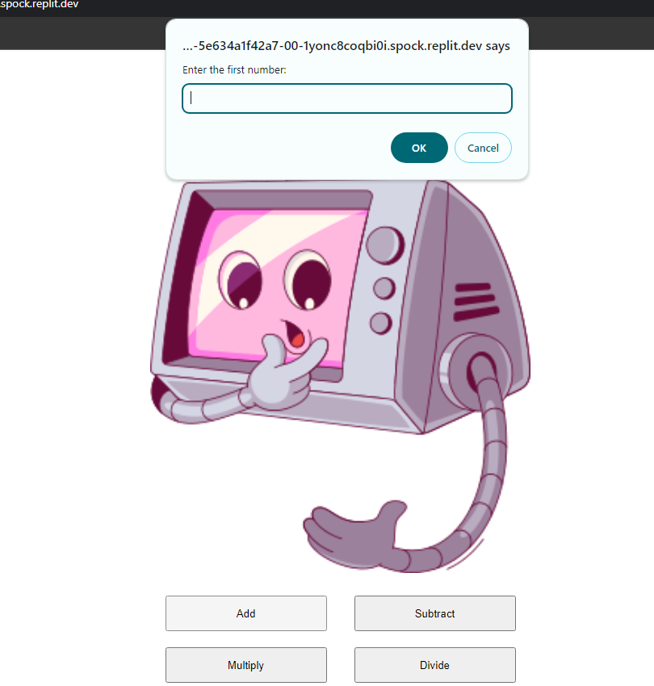

## Sigma School Module 1 - Calculator Project Project

## Languages

)
)

## Installation/Setup
- Clone, fork or download the project as zip.
- Open up the "index.html" file on your browser.

## Preview

<!--- target = "_blank" not supported in GIT HTML Markdowns --->
<!--- Discussion: https://stackoverflow.com/questions/41915571/open-link-in-new-tab-with-github-markdown-using-target-blank --->

## License
MIT © [Leow Kean Tat/Project Kazcade](https://github.com/KTLeow93584)
